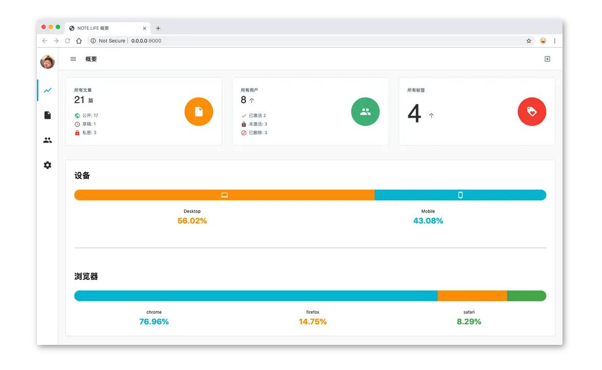

# manage UI (0.0.1 🧟‍)



     

## What's this ?

基于 [NOTE.LIFE](https://github.com/note-life/core) 提供的 RESTFUL API 服务，搭建的后台系统

[Live Demo](https://note-life-demo.hxtao.xyz)

## Have Done

- Markdown 编辑器 （支持表情插入、图片上传、实时预览、新标签预览、实时保存等）
- 多用户管理
- 文章管理（草稿、私密、公开三类）
- 友链、标签、归档配置
- 系统概要
- 邮件通知
- 初始化
- 登录

## Routes

- /setup  初始化
- /  登录
- /summary  概览
- /notes  文章管理
- /notes/:id  编辑或新建文章
- /users  用户管理
- /users/:id  编辑用户信息
- /configuations  配置管路
- /note-preview  新标签预览

## TODO

- 表情插入支持自定义表情
- 对接第三方图床（CDN）
- 接入评论
- 消息通知
- 自定义 script 配置后直接插入前端页面

## build

```bash
npm i && npm run build
```

## Issues

有任何意见或建议都欢迎提 [issue](https://github.com/note-life/manage-default/issues)

## License

MIT
